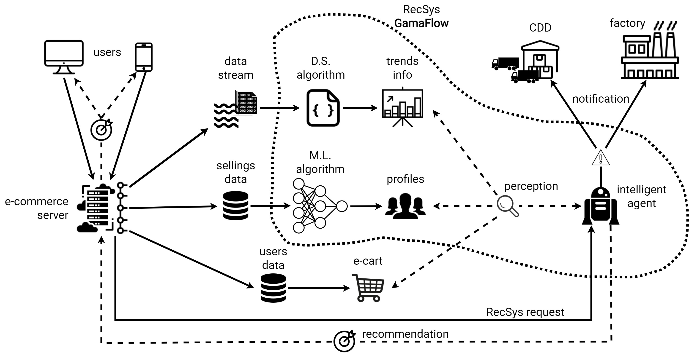

# Gama Flow 
## Visão Geral  
Esta é uma documentação modelo para os projetos do Academy Hack.  
Aqui você deverá descrever uma visão geral do seu projeto.  

[Link da Apresentação do Projeto](https://docs.google.com/presentation/d/1_thbqf4pGjSlmLS2WHl_3Q4oaW9Q3BhREpoJyFDRUsY/edit?usp=sharing)

### Problema  

Considerando a necessidade de se identificar mudanças no comportamento do mercado de forma automática e o crescimento exponencial no volume de informação, este projeto busca encontrar um sistema eficiente de recomendação, capaz de recomendar em tempo real produtos para os clientes ABInBev. Um sistema com essas características apresenta alta relevância nas duas pontas, tanto para os clientes quanto para a ABInBev. Isso se deve ao fato de que os clientes terão uma melhor experiência e maior lucratividade, pois estarão atualizados às tendências do mercado. Além disso, o sistema poderá auxiliar na manutenção da alta disponibilidade nos centros de distribuição da ABInBev, o que diminuiria o cancelamento de vendas por indisponibilidade.

### Proposta de solução  

Este projeto propõe uma aplicação híbrida de técnicas baseadas em Data Streams, Machine Learning e Agentes Inteligentes para categorizar, em tempo real, vendas B2B realizadas pela ABInBev. Através do dinamismo na evolução dessas categorias, será possível recomendar produtos considerando as características individuais de cada cliente. Isso será possível pois o projeto recomendará, com base na localização, comportamento do cliente, disponibilidade dos produtos e histórico de compras, as melhores opções para cada região. Além disso, como o sistema detecta mudanças no consumo, poderá notificar os centros de distribuição e as fábricas para que se adaptem a essas mudanças, garantindo a alta disponibilidade. Como resultado, espera-se o aumento dos lucros, elevar a experiência do cliente, estar atualizado às tendências de mercado e a prevenção de indisponibilidades.

# Informações Técnicas

## Arquitetura



> Arquitetura do projeto completo

## Pré requisitos

- Sistema Operacional: Windows 10
- Linguagem Utilizada: R, JavaScript, HTML, CSS
- Ferramentas: Node.js, NPM, Git, Visual Studio Code, RStudio
- Bibliotecas: express, cors, csvtojson

## Processo de instalação e execução

### Arquivos de entrada necessários

- ./src/csv/completo.csv: arquivo de entrada contendo os dados necessários para popular a base de dados
- Outra opção
  - carregar um arquivo em ./raw_data_analiser/Data.xlsx - Data.csv com a base fornecida pela Ambev
  - Rodar o script ./raw_data_analiser/analise_estatica.R para gerar o arquivo ./src/csv/completo.csv

### Subir a API

```cd src```  
```npm install```  
```npm start```  

### Visualizador

- Com o servidor rodando, acesse http://localhost:3000/  
- Clique nos botões para gerar compras falsas e testar o algoritmo
- Para ver todo o histórico dos top-k mais relevantes ao longo da história do algoritmo acesse a rota http://localhost:3000/historic

# Time

|  [<br><sub>@heitorfreitasferreira</sub>](https://github.com/heitorfreitasferreira) | [<br><sub>@claudineyrt</sub>](https://github.com/claudineyrt) |
 :---: | :---: |
